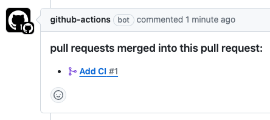

[](https://github.com/yumemi-inc/associated-pull-requests/actions/workflows/ci.yml)

# Associated Pull Requests

A GitHub Action that outputs a list of pull request numbers associated with commits between any references.

## Usage

See [action.yml](action.yml) for available action inputs and outputs.
Note that this action requires `contents: read` and `pull-requests: read` permissions.

### Supported workflow trigger events

Works on any event.
Basically it works as is, but if you want to customize it, refer to the [Specify comparison targets](#specify-comparison-targets) section.

### Basic

Use list of pull request numbers from `numbers` output.

```yaml
- uses: yumemi-inc/associated-pull-requests@v1
  id: associated-pr
- run: |
    for number in ${{ steps.associated-pr.outputs.numbers }}; do
      # do somethihg..
      echo "$number"
    done
```

By default, they are separated by spaces, but if you want to change the separator, specify it with `separator` input.

```yaml
- uses: yumemi-inc/associated-pull-requests@v1
  id: associated-pr
  with:
    separator: ','
```

If you want to output in JSON or Markdown instead of plain text like above, specify it with `format` input (default is `plain`).

```yaml
- uses: yumemi-inc/associated-pull-requests@v1
  id: associated-pr
  with:
    format: 'json' # or markdown
```

By default, list pull requests associated with merge commits.
To list pull requests associated with all commits, specify `true` for `merge-commit-only` input.
However, in this case, more pull requests can be detected, but the number of API calls will increase, so be careful when using it when the commit history is long.

```yaml
- uses: yumemi-inc/associated-pull-requests@v1
  id: associated-pr
  with:
    merge-commit-only: false
```

### Specify comparison targets

Commits between `head-ref` input and `base-ref` input references are used to search for associated pull requests.
The default values ​​for these inputs for each workflow trigger event are the same as [yumemi-inc/path-filter](https://github.com/yumemi-inc/path-filter#specify-comparison-targets), so refer to it for details, but note that this Associated Pull Requests action always performs [three-dot](https://docs.github.com/en/pull-requests/collaborating-with-pull-requests/proposing-changes-to-your-work-with-pull-requests/about-comparing-branches-in-pull-requests#three-dot-and-two-dot-git-diff-comparisons) comparison, does not support two-dot.

For example, to explicitly specify these inputs and list pull requests between `main` and `develop` branches:

```yaml
- uses: yumemi-inc/associated-pull-requests@v1
  id: associated-pr
  with:
    head-ref: 'develop'
    base-ref: 'main'
```

## Other examples

In a pull request, comment if there are any associated pull requests.



```yaml
name: Associated PR Report

on:
  pull_request:
    types:
      - opened
      - edited
      - reopened
      - synchronize

concurrency:
  group: ${{ github.workflow }}-${{ github.head_ref }}
  cancel-in-progress: true

jobs:
  report:
    name: PR report
    runs-on: ubuntu-latest
    permissions:
      contents: read # for yumemi-inc/associated-pull-requests
      pull-requests: write # for yumemi-inc/associated-pull-requests and yumemi-inc/comment-pull-request
    steps:
      - name: List associated pull request numbers
        uses: yumemi-inc/associated-pull-requests@v1
        id: associated-pr
        with:
          format: 'markdown'
      - name: Comment
        if: steps.associated-pr.outputs.numbers != null
        uses: yumemi-inc/comment-pull-request@v1
        with:
          comment: |
            ### pull requests merged into this pull request:
            ${{ steps.associated-pr.outputs.numbers }}
          previous-comment: 'hide'
```
